# Particle Filter SLAM
Simultaneous Localization and Mapping (SLAM) problem is a well-known problem in robotics, where a robot has to localize itself and map its environment simultaneously. Particle filter (PF) is one of the most adapted estimation algorithms for SLAM apart from Kalman filter (KF) and Extended Kalman Filter (EKF). 

In this project, a solution for SLAM based on particle filter and occupancy grid is developed. This solution is extended for texture mapping, which project color points from the RGBD sensor onto the occupancy grid in order to color the floor. The solution is evaluated with real-world odometry data, indoor 2-D laser scans, and RGBD measurements from THOR, a humanoid robot with lidar and Kinect v2 installed. It is able to estimate reliable map and robot trajectory on various dataset in reasonable time.

## File Details
### particle_filter.py

- Loads the provided data
- Has a sympy and lambda function based transformation matrix for faster computations. It creates a function which takes all the joint angles, current pose of the robot & LIDAR scans lin sensor frame and returns the xyz coordinates in world frame
- Initializes all the parameters required (MAP,correlation etc)
- Now inside the loop:
- Takes the lidar scan, gets joint angles using timestamp matching
- If it is the very 1st timestamp then assumes the robot position to be (0,0,0) and updates the log odds map accordingly
- If not then gets the positions of particles using motion model and noise
- Then transforms the lidar scan to world frame with respect to each particle
- Gets the correlation value using mapCorrelation() function
- Updates the weights and finds the best particle
- Gets the free space using the best particlle's position and the LIDAR scan that this particle observes
- Log odds map is updated using this particles position and the LIDAR scan that this particle observes
- Overfitting is done, i.e. limits on the maximum and minimum values in log odds map

The code is also well commented for more details.

### texture.py

- It loads all the provided data and the data saved from particle filter (MAP and trajectory)
- Has a sympy and lambda function based transformation matrix for faster computations. It creates a function which takes all the joint angles, current pose of the robot & LIDAR scans lin sensor frame and returns the xyz coordinates in world frame
- Calculates the xyz coordinates in optical frame of IR camera from the depth image
- Transforms these coordinates to world frame 
- Thresholds z to find only the ground plane
- Finds the corressponding xyz coordinates in optical frame of IR camera
- These ground xyz coordinates in optical frame are transformed to optical frame of RGB using extrinsic values
- Finds the corresponding pixels in RGB frame, check if they are feasible, i.e lie within RGB image dimensions
- The pixels which are feasible, their corresponding colors are then matched with the corresponding xyz coordinates in the world frame (we have these after thresholding z for ground)
- xy are converted to grid cells and the map is now filled with corresponding colors.

The code is also well commented for more details.

## Technical Paper
* [Saurabh Himmatlal Mirani. "Particle Filter SLAM" Feb. 2020](report/ParticlFilterSLAM.pdf)

## Results
* 1st Column shows the dead recknoning trajectory (without Particle Filter) and corressponding map 
* 2nd Column shows the Particle Filter trajectory and corressponding free space map
* 3rd Column shows the Particle Filter trajectory and corressponding occupancy map

### Case 1:

  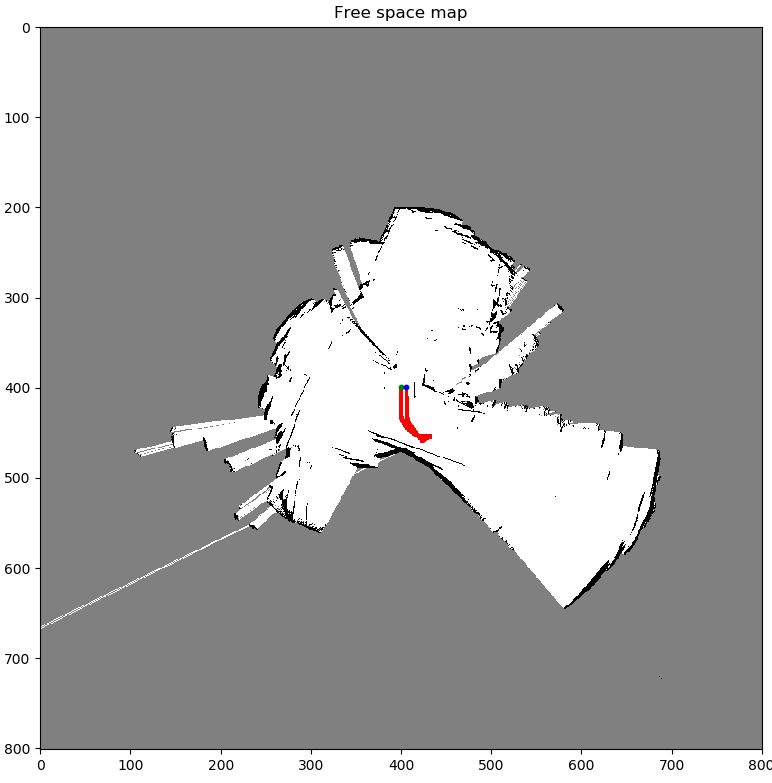
  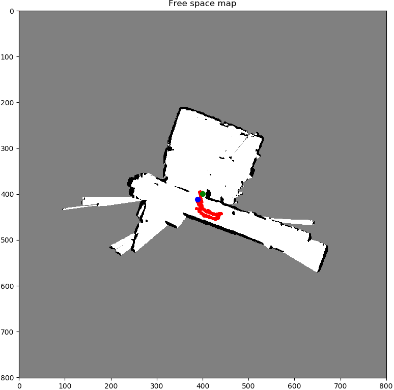 
  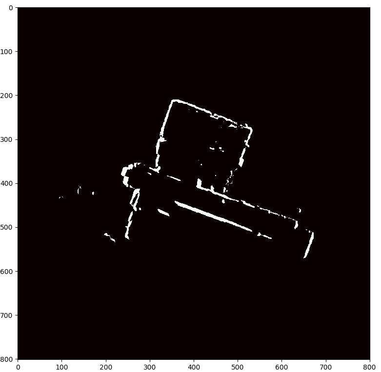 

### Case 2:

  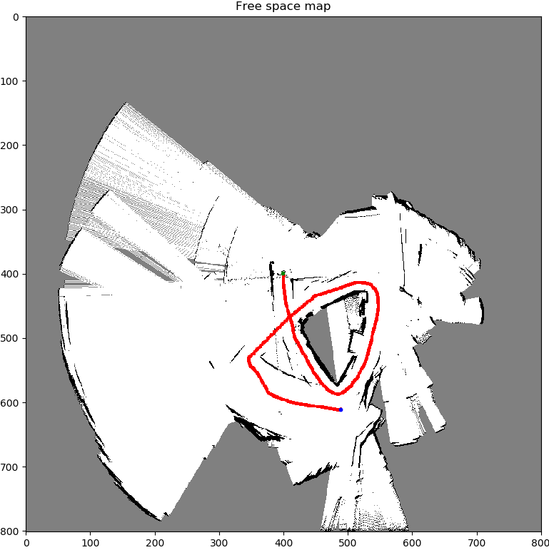
  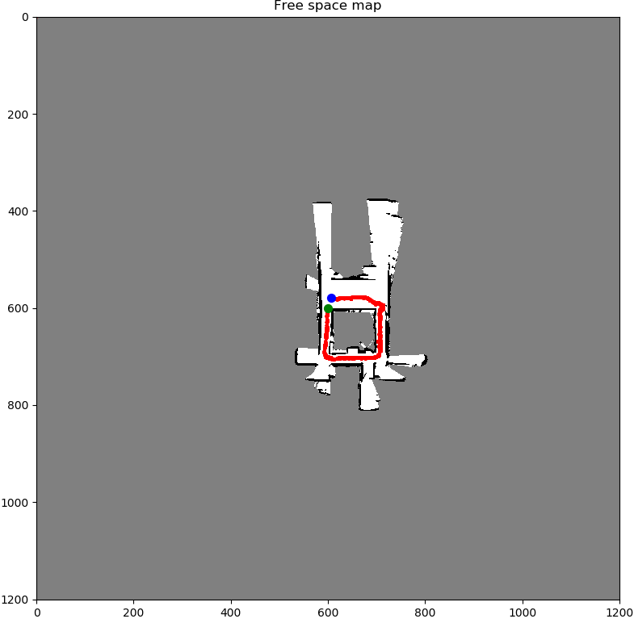 
  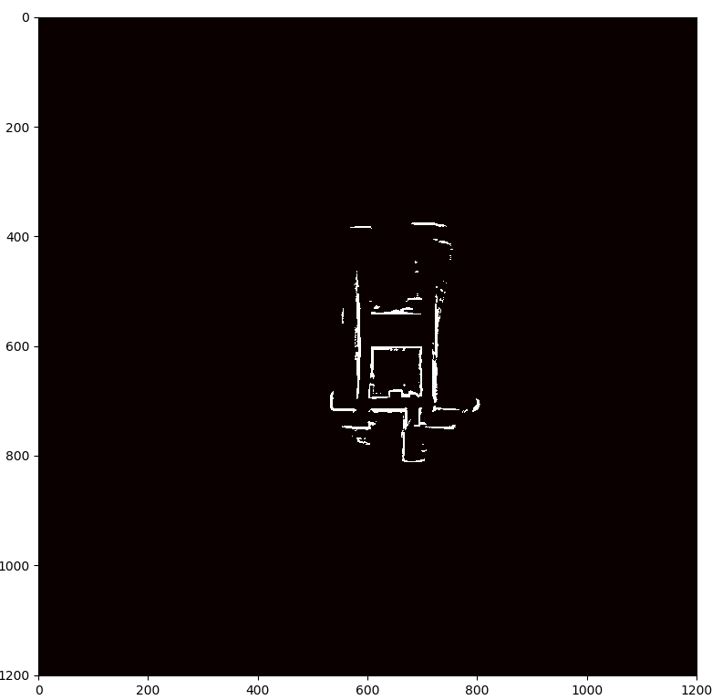 

### Case 3:

  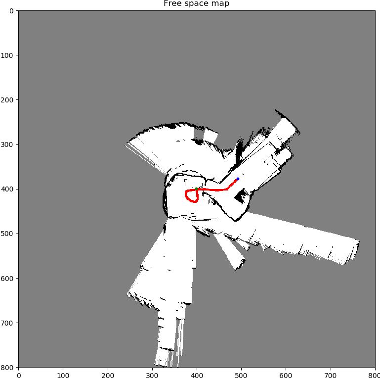
  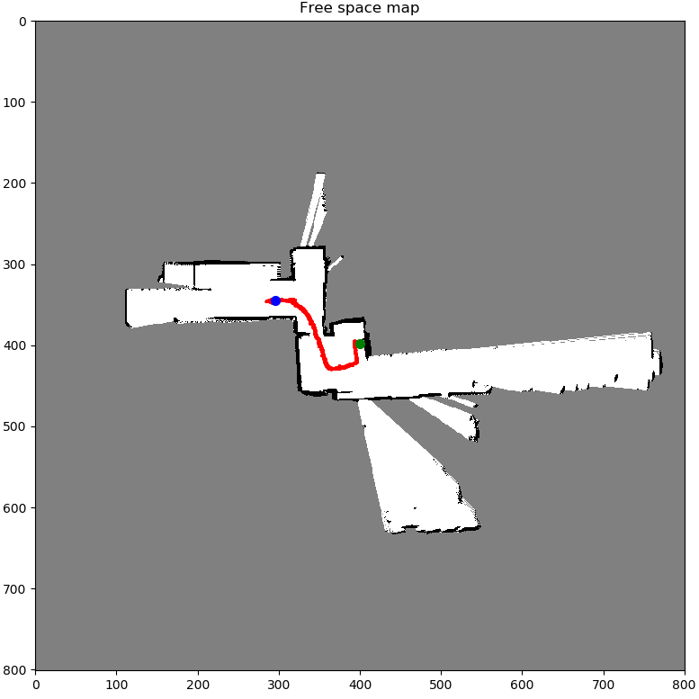 
  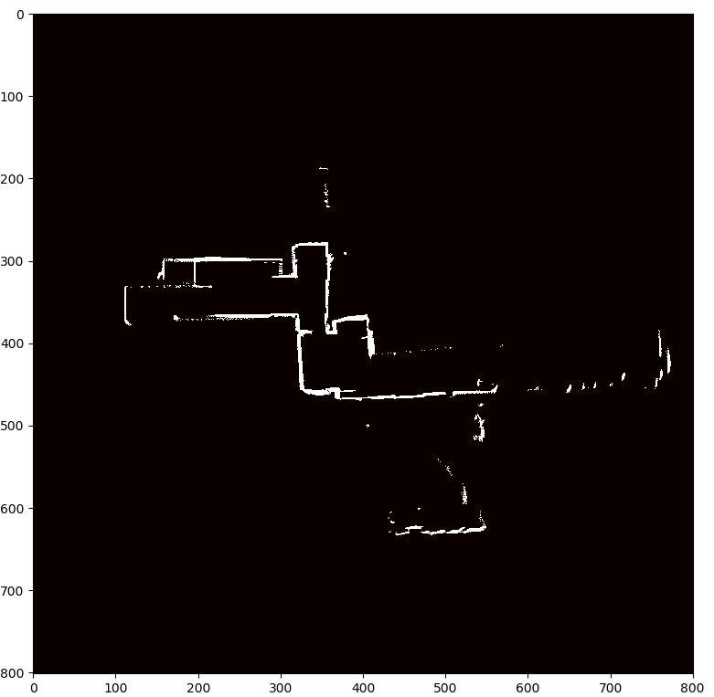 

### Texture Mapping

#### Case 1:

  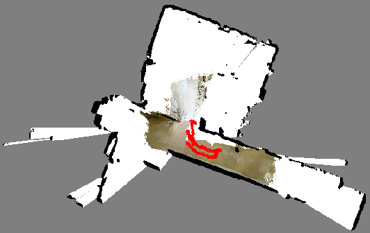

#### Case 3:

  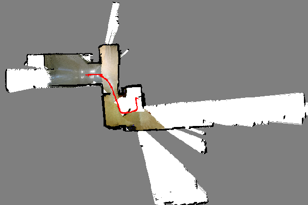

